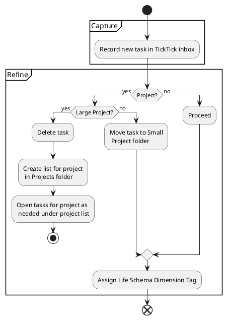

---
{"created":"2023-01-14T11:35:52-06:00","updated":"2023-02-02T16:39:20-06:00","title":"How I Organize TickTick","zettelgarden":true,"zettelType":"concept","dg-publish":true,"permalink":"/z/notes/how-i-organize-tick-tick/","dgPassFrontmatter":true}
---

# How I Organize TickTick
#self/life-optimization/org-tools 
#self/life-optimization/project-management 
#self/life-optimization/organization/task-management 
## Summary
TickTick is an amazing tool, combining task management with time-blocking functionality, a habit tracker, notes, and list management. All of that at a very reasonable cost of $3/mo. Having said that, the best tool in the world is useless without a good system to use it.

## Methodology 
### Lists
I have the following lists setup in TickTick:
* Tasks
	* On Deck
	* Soon
	* Eventually
	* Someday Maybe
	* Blocked
* Projects
	* Small Projects
	* (A list for each large project)
* Routine
	* Meal Plan 
	* Chores
	* Planning
* Shopping
	* Groceries
	* Target
	* Amazon
	* Costco
	* Home Depot
	* Other
* Notes

### Tags
These are the tags I have set up:
- self
- home
- office
- world

### Setting up tasks and projects
Tasks go into TickTick's inbox for capture  I can capture easily from my phone or PC, where I've setup CTRL+ALT+. as my hotkey for the quick add function.

When I'm ready to categorize tasks out of the inbox I can decide if they're tasks or projects. Tasks are composed of a single action, whereas projects comprise multiple actions. If the task in question is actually a project then I decide if it's a large or small project. This is purely a subjective judgement call, but you could say a small project can be completed in a day whereas large projects take multiple days, weeks, or longer. If it's a large project then the original task gets deleted and a list is created under the Projects folder to hold all the tasks for the project. If it's a smaller project then the task gets moved into the Small Projects list and any tasks associated with that project can be opened as subtasks.

If the task in question is a true task then it can be moved to the appropriate folder depending on how the tasks is to be staged:
- On Deck - Tasks that will be completed within the next week or so
- Soon - Tasks that will be completed within the next month or so, or later if there is an assigned date.
- Maybe Someday - Tasks with no assigned date that may or may not be completed.
- Blocked Waiting - Tasks which are blocked from being completed or waiting for someone else to do something before they can be completed.

In addition to moving the task/project, It's important to tag the task with the appropriate [Life Schema](Life%20Schema.md) dimension:
- Self - Tasks that pertain to my self or self-interests.
- Home - Tasks that pertain to the house or family interests.
- Office - Work tasks, or tasks that are professional, career, or business-related.
- World - Tasks that relate to the world at-large, including extended family, friends, appointments, etc.

## See Also
- [Getting Shit Done Quick (GSDQ)](Getting%20Shit%20Done%20Quick%20(GSDQ).md)
- 